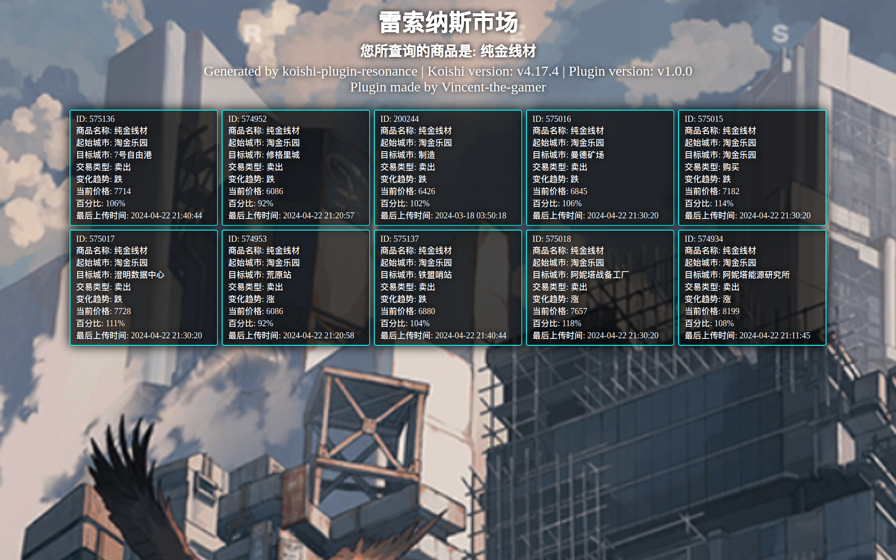

# koishi-plugin-resonance-market

[](https://www.npmjs.com/package/koishi-plugin-resonance-market)

雷索纳斯市场查询

# 安装
在Koishi插件市场搜索resonance-market安装

# 配置
插件设置中可以开启/关闭图片输出模式，关闭则使用纯文本。(图片输出模式需要puppeteer插件支持)

# 指令
```shell
# 查询商品信息
雷索纳斯市场 <商品名>

# 或
倒货 <商品名>
```

# 预览
